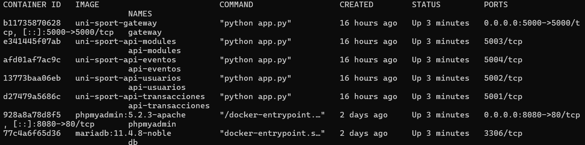
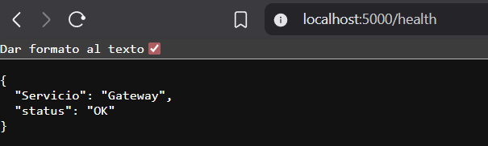
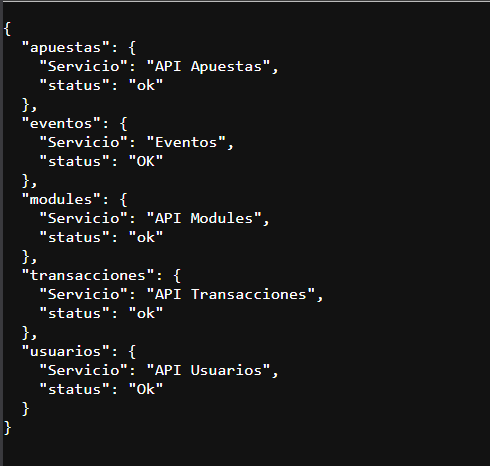
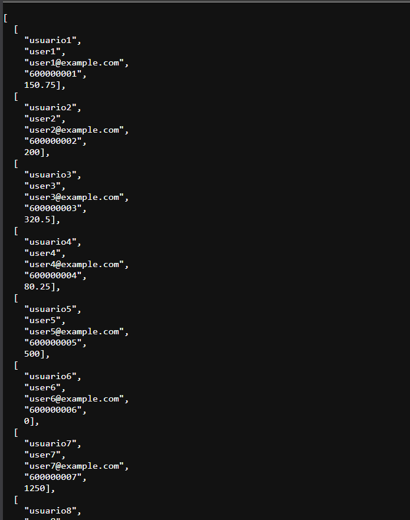
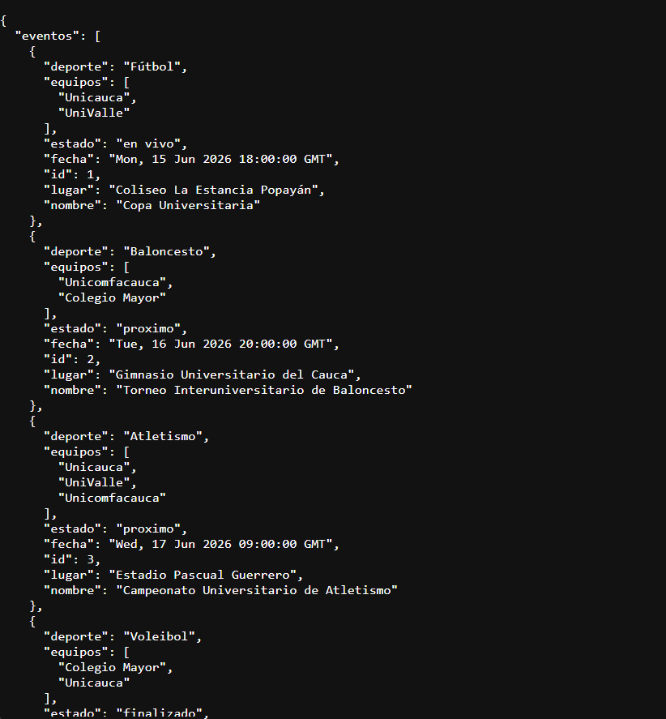
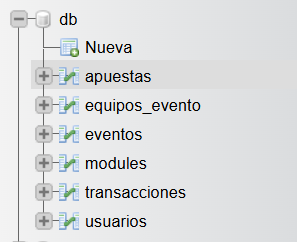
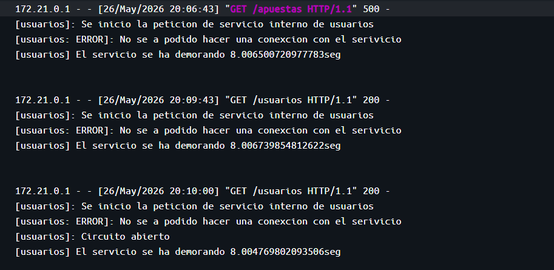
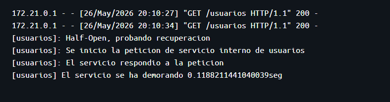

# 🏆 UniSport — Plataforma de Apuestas Deportivas Universitarias

Sistema distribuido de apuestas deportivas enfocado en torneos universitarios. Permite a los usuarios registrarse, autenticarse, consultar eventos deportivos y gestionar transacciones y apuestas.

---

## 🛠️ Tecnologías utilizadas

- **Backend:** Python + Flask
- **Base de datos:** MySQL (MariaDB)
- **Contenerización:** Docker + Docker Compose
- **Frontend:** React + TypeScript + Vite
- **Administración BD:** phpMyAdmin

---

## 📁 Estructura del proyecto

```
uni-sport/
├── gateway/
├── api-usuarios/
├── api-transacciones/
├── api-eventos/
├── api-apuestas/
├── api-modules/
├── Front/
├── db/
├── evidencias/
├── .env.example
├── .gitignore
└── Compose.yaml
```

---

## ⚙️ Requisitos previos

- [Docker](https://www.docker.com/products/docker-desktop)
- [Node.js](https://nodejs.org/) — solo para el frontend

---

## 🚀 Instrucciones de ejecución

### 1. Clonar el repositorio
```bash
git clone https://github.com/iNothingAtAll/uni-sport
cd uni-sport
```

### 2. Configurar variables de entorno
```bash
cp .env.example .env
# Editar .env con tus credenciales
```

### 3. Levantar los servicios
```bash
docker-compose up --build
```

### 4. Levantar el frontend
```bash
cd Front
npm install
npm run dev
```

---

## 🌐 Servicios y puertos

| Servicio | Puerto | Descripción |
|---|---|---|
| Gateway | 5000 | Punto de entrada único |
| api-transacciones | 5001 | Gestión de transacciones |
| api-usuarios | 5002 | Gestión de usuarios y auth |
| api-modules | 5003 | Menú lateral dinámico |
| api-eventos | 5004 | Eventos deportivos |
| api-apuestas | 5005 | Apuestas |
| MySQL | 3306 | Base de datos |
| phpMyAdmin | 8080 | Administración BD |
| Frontend | 5173 | Interfaz de usuario |

---

## 📌 Endpoints del Gateway

### Usuarios
| Método | Endpoint | Descripción |
|---|---|---|
| GET | `/usuarios` | Lista todos los usuarios |
| GET | `/usuario/<id>` | Obtiene un usuario por ID |
| POST | `/usuario/auth` | Autenticación |
| POST | `/registro` | Registro de nuevo usuario |

### Transacciones
| Método | Endpoint | Descripción |
|---|---|---|
| GET | `/transacciones` | Lista todas las transacciones |
| GET | `/transaccion/<id>` | Obtiene una transacción por ID |
| GET | `/transacciones/usuario/<id>` | Transacciones de un usuario |

### Eventos
| Método | Endpoint | Descripción |
|---|---|---|
| GET | `/eventos` | Lista todos los eventos deportivos |
| GET | `/evento/<id>` | Obtiene un evento por ID |

### Sistema
| Método | Endpoint | Descripción |
|---|---|---|
| GET | `/health` | Estado del gateway |
| GET | `/metricas` | Estado de todos los servicios |
| GET | `/modules` | Módulos del menú lateral |

---

## 🧩 Arquitectura

El sistema implementa una arquitectura de **microservicios** donde cada servicio es independiente con su propia responsabilidad. El gateway actúa como punto de entrada único que redirige las peticiones.

```
[Frontend :5173]
       ↓
[Gateway :5000]
       ↓
┌──────────────────────────────────┐
│ api-usuarios     :5002           │
│ api-transacciones :5001          │
│ api-eventos      :5004           │
│ api-modules      :5003           │
└──────────────────────────────────┘
       ↓
[MySQL :3306]
```

---

## ⚡ Tolerancia a fallos

El sistema implementa **Circuit Breaker con Half-Open**:

- **Cerrado:** peticiones fluyen normalmente
- **Abierto:** después de 3 fallos, rechaza peticiones inmediatamente sin intentar llamar al servicio caído
- **Half-Open:** después de 30 segundos, deja pasar una petición de prueba para verificar recuperación

```python
circuit_breaker = {
    'usuarios': {"fallos": 0, "circuito_abierto": False, "tiempo_apertura": None},
    'transacciones': {"fallos": 0, "circuito_abierto": False, "tiempo_apertura": None},
    ...
}
```

---

## 📋 Monitoreo

- **Logs** descriptivos en cada petición con tiempo de respuesta
- **Health checks** en cada servicio vía `/health`
- **Métricas** de disponibilidad en `/metricas`
- **Contador de errores** por servicio en el circuit breaker

---

## 🔐 Variables de entorno

Crear un archivo `.env` basado en `.env.example`:

```
MYSQL_DATABASE=
MYSQL_USER=
MYSQL_PASSWORD=
MYSQL_ROOT_PASSWORD=
PMA_HOST=
PMA_PORT=
```

⚠️ Nunca subir el archivo `.env` al repositorio.

---

## 📸 Evidencias

### Docker — Contenedores corriendo


### Gateway — Estado del sistema


### Métricas — Estado de todos los servicios


### Usuarios — Comunicación entre servicios


### Eventos — Datos desde la base de datos


### Base de datos — phpMyAdmin


### Circuit Breaker — Servicio caído y circuito abierto


### Half-Open — Recuperación del servicio

