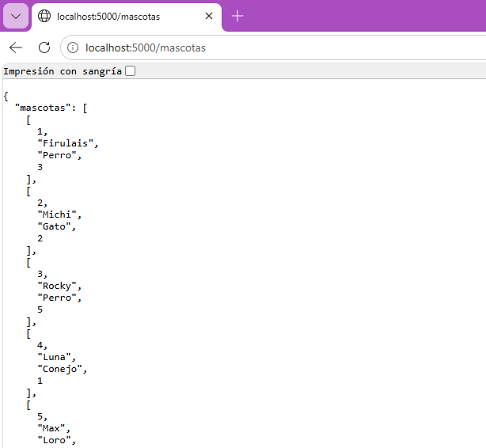
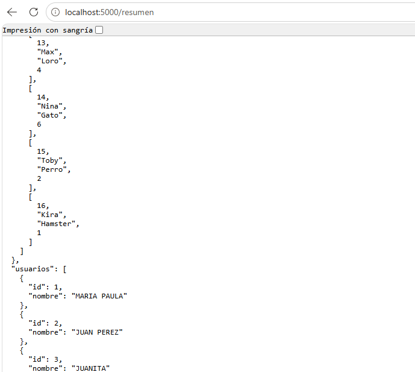
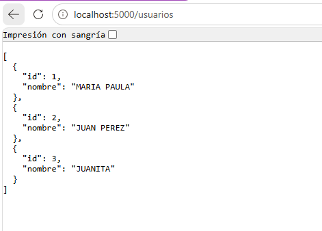

LEVANTAR EL PROYECTO

docker compose up --build

Si algún puerto está ocupado:

gateway:
  ports:
    - "5050:5000"

Luego acceder desde:

http://localhost:5050

#########################

FUNCIONAMIENTO DEL CIRCUIT BREAKER

 Practica indicada para Sistemas distribuidos implementando dos fases.

FASE 1::
- Se apago el servicio Backend haciendo multiploes peticiones al gateway.
- El sistema de intenta conectar multiples veces llegando a su punto limite.

Evidencia-Contenedores 

Validacion de base de datos funcional con mascotas:

Curl inicial de mascotas.

Fase 2:: Aplicar Circuitos

Un circuito independiente:

/mascotas
/usuarios
/resumen

Esto permite que:

Si falla un servicio el siguiente sigue funcionando

ESTADOS DEL CIRCUITO
Estado	Comportamiento
cerrado	Las peticiones pasan normalmente
abierto	El gateway bloquea peticiones
half-open	Se permite una petición de prueba

#########################

ENDPOINTS DISPONIBLES
GATEWAY
Método	Endpoint	Descripción
GET	/	Verifica que el gateway está activo
GET	/estado	Muestra el estado de los circuitos
SERVICIOS
Método	Endpoint	Descripción
GET	/usuarios	Consulta usuarios
GET	/mascotas	Consulta mascotas
GET	/resumen	Combina ambos servicios

#########################

IMPLEMENTACIÓN
CIRCUITOS INDEPENDIENTES
cb_backend  = CircuitBreaker("backend")
cb_usuarios = CircuitBreaker("usuarios")

Cada microservicio mantiene:

su contador de fallos,
su estado,
y su recuperación.
CONTROL DE FALLOS

Cuando un servicio falla:

self.fallos += 1

Después de 3 errores:

self._cambiar_estado("abierto")

El gateway deja de enviar peticiones.

RECUPERACIÓN AUTOMÁTICA

Después de 20 segundos:

self._cambiar_estado("half-open")

Se deja pasar una petición de prueba.

Si funciona:

→ circuito cerrado

Si falla:

→ circuito abierto nuevamente

#########################

PRUEBAS REALIZADAS
SERVICIO FUNCIONANDO
curl http://localhost:5000/mascotas

Respuesta:

SERVICIO CAÍDO

Apagar backend:

docker stop pet_shop_clase_sd_g1-backend-1
.png)

Realizar varias peticiones:

curl http://localhost:5000/mascotas

Logs:

[backend] Fallo #1
[backend] Fallo #2
[backend] Fallo #3

[backend] Límite alcanzado → circuito ABIERTO
CIRCUITO ABIERTO

Respuesta del gateway:

Sin embargo ususarios continua funcionando como circuito independiente:

Revision de estado de los circuitos

#####Tercera fase:
half-open 

ls tres estados del circuit breaker:
CERRADO: Las peticiones siguen pasando normalmente
ABIERTO: Bloquea inmediatamente devolviendo 503
HALF-OPEN: Deja pasar una peticion de tipo test

Cuando pasa a half-open? despues de haber pasado el tiempo de espera =20

Si falla la prueba el contador se reinicia y vuelve a estado ABIERTO 

###Recuperación automatica:
Baja del backend de nuevo y correr start-sleep -second 21

start a backend y posteriormente lanzar curl a mascotas donde la respuesta sera exitosa y half-open CERRADO

Verificacion con /estado:

###Fase cinco
Recuperación del sistema:

servicio caido _

Bloqueo inmediato:

Recuperación:

mascotas recuperado:

--------------------SEGUNDA GUIA---------------------------------------------------

LEVANTAR EL PROYECTO

docker compose up --build

Si algún puerto está ocupado:

gateway:
  ports:
    - "5050:5000"

curls funcionando:
mascotas:

usuarios:

revision de logs:

